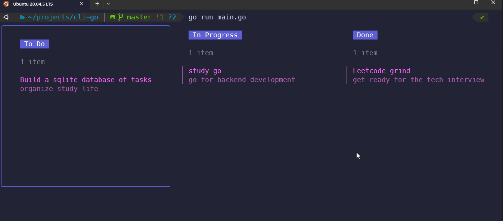

# CLI Kanban Board

This is a command-line interface (CLI) tool for managing tasks using a Kanban board. The board has three columns: "To Do", "In Progress", and "Done". Tasks can be moved between the columns by the user.

The command-line interface (CLI) application establishes a connection with a SQLite database that serves as a persistent data store for all task-related information entered by the user. Upon adding or removing a task via the CLI, the application triggers a database operation to update the relevant data. This ensures that the user's task data is always in sync with the application state, even when the application is restarted.

You can use the following commands to manage tasks:

- `add`: Add a new task to the "To Do" column.
- `move`: Move a task between columns.
- `remove`: Remove a task from the board.
- `quit`: Quit the program.

## Contributing

Contributions are welcome! If you find a bug or have an idea for a new feature, please open an issue or submit a pull request.

## License

This project is licensed under the MIT License. See the [LICENSE](LICENSE) file for details.

